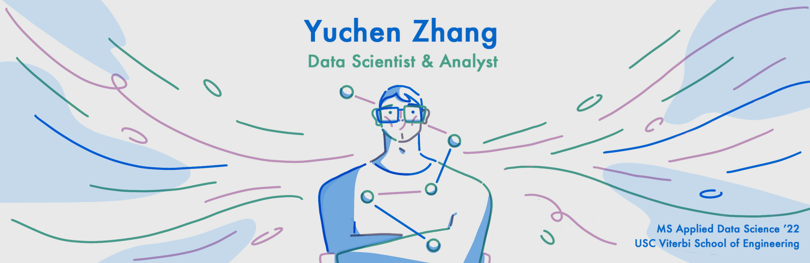

<!--
**Anthonyive/anthonyive** is a ✨ _special_ ✨ repository because its `README.md` (this file) appears on your GitHub profile.

Here are some ideas to get you started:

- 🔭 I’m currently working on ...
- 🌱 I’m currently learning ...
- 👯 I’m looking to collaborate on ...
- 🤔 I’m looking for help with ...
- 💬 Ask me about ...
- 📫 How to reach me: ...
- 😄 Pronouns: ...
- ⚡ Fun fact: ...
-->

### Hi there, I'm Yuchen 👋️

## I'm a Student, Developer, and Data Science Enthusiast!
- 🔭 I’m currently working on [Mapping Uncanny Valley project](https://github.com/Anthonyive/Research-Mapping-Uncanny-Valley.git) at USC and my personal website (open-source once deployed).
- 🌱 I’m currently learning Data Science and Web Development.
- 👯 I’m looking to collaborate on any open source project.
- 🤔 I’m looking for help with NLP and Blog Development.
- 📫 How to reach me: [email me](mailto:yzhang71@usc.edu)
- 😄 Pronouns: He/Him/His
- ✍️ 2021 Goals: Contribute more to Open Source projects and receive offer(s) from FAANG.
- 🤪 Fun fact: I love leather working and I enjoy building my own pc "battlestations".

## 🔨 Technologies & Tools

  

  

  
More Stats about Me

    
  
    
  

  [][instagram]

[instagram]: https://www.instagram.com/anthonyive/
